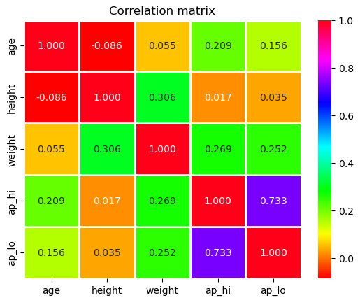

# Cardio Vascular Disease Detector

## Introduction

Cardiovascular disease (CVD) is the leading cause of mortality globally, often progressing unnoticed until critical stages. Early detection enables timely intervention, saving lives, and reducing healthcare costs. This project leverages machine learning and FastAPI to develop an application for predicting the risk of cardiovascular disease based on individual health indicators.

---
## Problem Description
Cardiovascular diseases are responsible for the highest mortality rate globally. Identifying high-risk individuals early is critical for timely interventions that can save lives and reduce healthcare costs. This project uses the Kaggle Cardiovascular Disease dataset, which contains 70,000 patient records with 12 features, to build a machine learning model capable of predicting the likelihood of cardiovascular disease.
___

## Architecture Overview

The project is designed with modularity, and efficiency in mind. Below is an architectural overview:


### Components
1. Data Pipeline:
   - Data cleaning, preprocessing, and feature engineering are handled programmatically using a python script.
   - [Dataset]('https://www.kaggle.com/datasets/sulianova/cardiovascular-disease-dataset'): Kaggle Cardiovascular Dataset containing 70,000 records.

2. Modeling:
   - XGBoost model for prediction, trained with hyperparameter tuning.
   - `DictVectorizer` for encoding categorical variables.

3. Application Backend:
   - FastAPI Framework: Hosts the prediction API.
   - Logging: Tracks requests and debugging information.
   - Input Validation: Ensured using Pydantic models.

4. Containerization:
   - Docker container with FastAPI and model preloaded for consistent deployment across environments.

5. Deployment:
   - Hosted on [**Fly.io** ](https://fly.io), exposing the API to public requests.

### Data Flow
1. User Input: JSON payload with patient health data is sent to the application prediction endpoint.
2. Data Validation: Pydantic validates and parses input data.
3. Prediction Logic:
   - Data transformed using `DictVectorizer`.
   - Transformed data passed to the XGBoost model.
   - Model outputs prediction probability and binary classification.
4. API Response: JSON response returned to the user.

---

### Project Structure
The project is organized as follows:

1. Notebooks:
   - [`notebook.ipynb`](./notebooks/notebook.ipynb): Contains data preparation, model training, evaluation, and selection processes.
2. Scripts:
   - [`model_trainer.py`](./scripts/model_trainer.py): Encapsulates the data preparation and final model training logic.
3. [`main.py`](./main.py): The FastAPI application script that serves the model predictions.
4. Configuration Files:
   - `Pipfile`: Manages project dependencies.
   - `fly.toml`: Specifies the hosting environment requirements for deployment on fly.io.
5. Dockerfile: Defines the steps to containerize the application using Docker.
6. Dataset:
   - [`cardio_vascular_disease_dataset.csv`](./data/cardio_vascular_disease_dataset.csv): The dataset used for training and evaluation, with its path specified in the .env file as DATASET_PATH.
7. Models:
   - `model.bin`: The serialized model and DictVectorizer saved after training.

___

## Dataset Details

The **Cardiovascular Disease Dataset** was sourced from **[Kaggle](https://www.kaggle.com/datasets/sulianova/cardiovascular-disease-dataset)**. It contains 70,000 patient records with multiple health indicators relevant to predicting cardiovascular disease (CVD). The dataset is intended for binary classification, where the target variable indicates the presence or absence of cardiovascular disease.

#### Dataset Structure

- **Rows:** 70,000
- **Columns:** 12 (11 features + 1 target variable)

---

### Fields Description

| **Field**       | **Description**                                                                                                   | **Type**     |
|------------------|-------------------------------------------------------------------------------------------------------------------|--------------|
| **Age**          | Age of the patient in days.                                                                                      | Numeric      |
| **Gender**       | Gender of the patient (`1` for female, `2` for male).                                                            | Categorical  |
| **Height**       | Height of the patient in centimeters.                                                                            | Numeric      |
| **Weight**       | Weight of the patient in kilograms.                                                                              | Numeric      |
| **AP_hi**        | Systolic blood pressure (higher number in the blood pressure reading).                                           | Numeric      |
| **AP_lo**        | Diastolic blood pressure (lower number in the blood pressure reading).                                           | Numeric      |
| **Cholesterol**  | Cholesterol level (`1`: normal, `2`: above normal, `3`: well above normal).                                      | Categorical  |
| **Gluc**         | Glucose level (`1`: normal, `2`: above normal, `3`: well above normal).                                          | Categorical  |
| **Smoke**        | Indicates whether the patient smokes (`0`: no, `1`: yes).                                                       | Binary       |
| **Alco**         | Indicates whether the patient consumes alcohol (`0`: no, `1`: yes).                                             | Binary       |
| **Active**       | Indicates whether the patient engages in physical activity (`0`: no, `1`: yes).                                 | Binary       |
 **Cardio**       | Target variable indicating the presence of cardiovascular disease (`0`: no, `1`: yes).                          | Binary       |


### Preprocessing Adjustments
   - There were no missing values in the dataset.
   - Features were scaled (e.g., standardization for numerical variables).
   - Outliers in `AP_hi` and `AP_lo` were addressed based on medical thresholds.

This dataset was chosen for its comprehensiveness and relevance to building a machine learning model for cardiovascular disease risk prediction. It includes a mix of categorical, binary, and numerical features that align with real-world patient profiles.


## Model Selection

### Numerical variable correlation

Following EDA on the dataset, a correlation matrix was evaluated and results were aas follows


Observations were;
1. Strong Correlation Between `ap_hi` and `ap_lo`:

- Correlation coefficient = `0.733`.
- This strong positive correlation was expected, as systolic and diastolic blood pressures are physiologically related.

2. Moderate Correlations were also observed for`weight` showing moderate positive correlations with: 
- `height` (0.306): Taller individuals generally weighing more.
- `ap_hi` (0.270) and `ap_lo` (0.252): Higher weight often being associated with elevated blood pressure.

3. The Weak Correlations observered were `age` is weakly correlated with:
- `ap_hi` (0.209): Older individuals having a slightly higher systolic blood pressure.
- `ap_lo` (0.156): A similar trend for diastolic blood pressure.
- `age` and `weight` (0.055): Minimal association between age and weight.
- `height` and` blood pressure` (`ap_hi`: 0.017, `ap_lo`: 0.035): Negligible correlation between height and blood pressure.

4. The negative Correlations observerd were:
- `age` and `height` (-0.086): A weak negative correlation indicates older individuals tending to be shorter, possibly due to age-related changes like bone density loss.

These observations paved way to take the assumption that given the weak relationships, there was justification to use more complex, non-linear analysis techniques, as linear models would not capture significant patterns effectively.

Therefore my choice for the project spanned testing
1. Decision tree
2. Random forest
3. XGBoost

The project evaluated several models before finalizing **XGBoost**. Below is a comparison of their performance:

### Final Model Comparison

Below is the comparison of models based on their performance metrics:

| Model                 | AUC-ROC  | Accuracy |
|-----------------------|----------|----------|
| **Decision Tree**     | 79.2%   | 73.05%   |
| **Random Forest**     | 79.9%   | 72.76%   |
| **XGBoost**           | 79.9%  | 73.19%   |

### Best Model Selection

The **XGBoost model** was chosen as the final model based on its high AUC-ROC (80.14%) and accuracy (80.14%). It demonstrated robust performance with fine-tuned parameters:
- **Learning Rate (eta):** 0.1
- **Max Depth:** 5
- **Min Child Weight:** 15
- **Boosting Rounds:** 100

This model balances generalization and accuracy, making it suitable for deployment in production.

## Instructions to Run the Application

### Prerequisites
1. Python 3.9+: Ensure Python is installed on your machine.
2. Pipenv: Install Pipenv for dependency management.
3. Docker (optional): To run the application in a containerized environment.

### Local Setup
1. Clone the repository:
   ```bash
   git clone `git@github.com:okellodaniel/cardio_vasicular_disease_detector.git`
   cd cardio-vascular-disease-detector
   ```

2. Install dependencies:
   ```bash
   pip install pipenv
   pipenv install --system --develop
   ```

3. Run the application:
   ```bash
   uvicorn app.main:app --port 5050
   ```

4. Test locally using the FastAPI docs:
   - Open a browser and navigate to `http://localhost:5050/` for an interactive scalar api docs interface.

---

### Using Docker
1. Build the Docker container:
   ```bash
   docker build -t cardio-detector .
   ```

2. Run the container:
   ```bash
   docker run -p 5050:5050 cardio-detector
   ```

### Cloud Deployment
The application is hosted on `fly.io` and can be accessed via:
- **URL**: [https://cardio-vasicular-disease-detector.fly.dev](https://cardio-vasicular-disease-detector.fly.dev)

## Testing the Application

### **Using Scalar API Docs**
Scalar API Docs is an extension for testing FastAPI applications.

1. **Using cURL**
Send a POST request to test the API:
```bash
curl -X POST "http://localhost:5050/" \
-H "Content-Type: application/json" \
-d '{
  "age": 18300,
  "gender": "male",
  "height": 168,
  "weight": 62,
  "ap_hi": 120,
  "ap_lo": 80,
  "cholesterol": "normal",
  "gluc": "normal",
  "smoke": "no",
  "alco": "no",
  "active": "yes"
}'
```

2.  **Using Python Requests**

```python
import requests

url = "http://localhost:5050/"
data = {
    "age": 18300,
    "gender": "male",
    "height": 168,
    "weight": 62,
    "ap_hi": 120,
    "ap_lo": 80,
    "cholesterol": "normal",
    "gluc": "normal",
    "smoke": "no",
    "alco": "no",
    "active": "yes"
}
response = requests.post(url, json=data)
print(response.json())
```

**Expected Response**
```json
{
  "prediction": 0.2345,
  "cardio": false,
  "prediction%": "23.45%",
  "threshold": 0.5
}
```

---

## Future Improvements

1. **Integration with Healthcare Systems:**
   - Stream real-time data from IoT devices for continuous monitoring.

2. **Model Enhancements:**
   - Explore deep learning models for complex feature interactions.
   - Investigate ensemble learning techniques to improve prediction reliability.

3. **Explainability:**
   - Implement SHAP (SHapley Additive exPlanations) for better interpretability of predictions.

4. **Scalability:**
   - Deploy on Kubernetes to handle high traffic and ensure availability.

5. **User Interface:**
   - Add a web-based dashboard for healthcare professionals to interact with predictions.

---